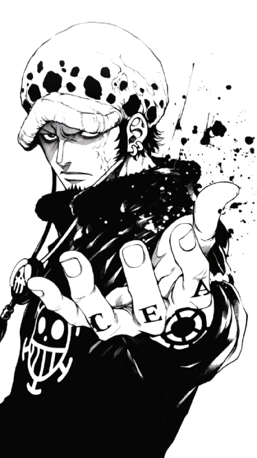
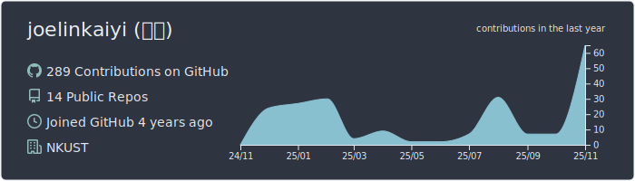
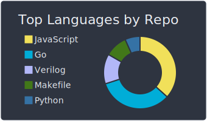
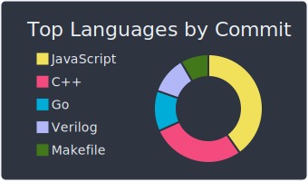
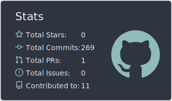
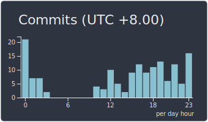

<!-- Right-side big character -->

# joelinkaiyi

> **“Practices makes perfect.”**

Always grinding — sometimes solo, sometimes with the crew.  
Coding daily — shipping tools, apps, and ideas that grow in silence.  
Not for the streak, but for the vision.

Thanks for watching — it means a lot!

---

## Profile

- 🎓 Student at **National Kaohsiung University of Science and Technology (NKUST)**
- 💻 Focus: **Web Dev, System Programming, AI Tools**
- ⚔ Constant practice to sharpen engineering mindset  
- 🚀 Building toward full-stack + system-level mastery  

---

## Tech Stack

**Languages**  

**Web Dev**  

**Platforms & Tools**  

**Boards**  

**Package Managers**  

**Operating Systems**  

---

## Contribution Graph  

---

## GitHub Summary Cards  

---

## Social  

---

## Philosophy  
> “Practices makes perfect.”  
> Level up, one commit at a time.
